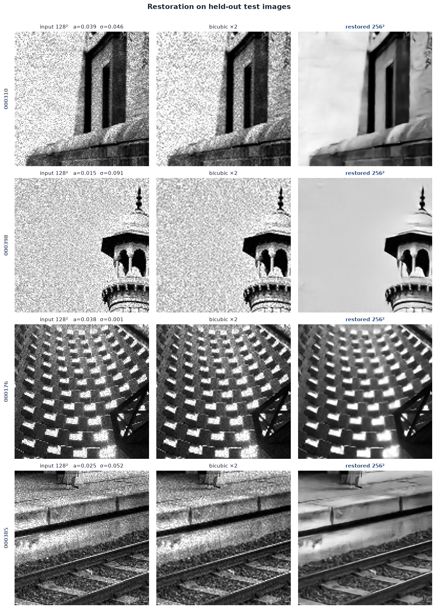
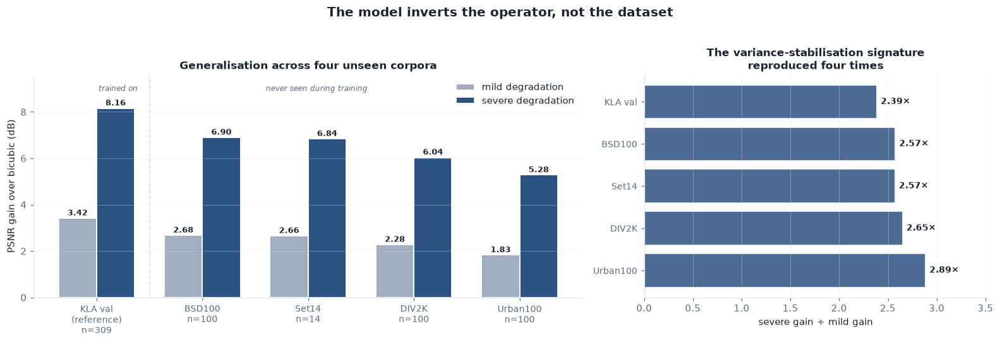
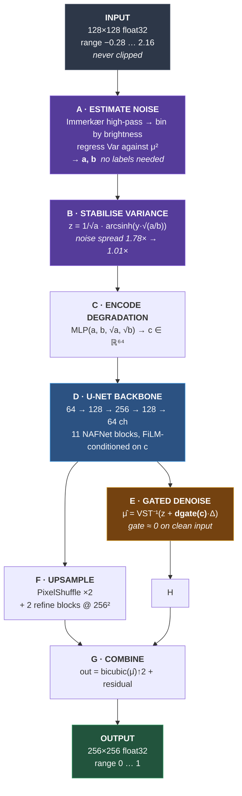
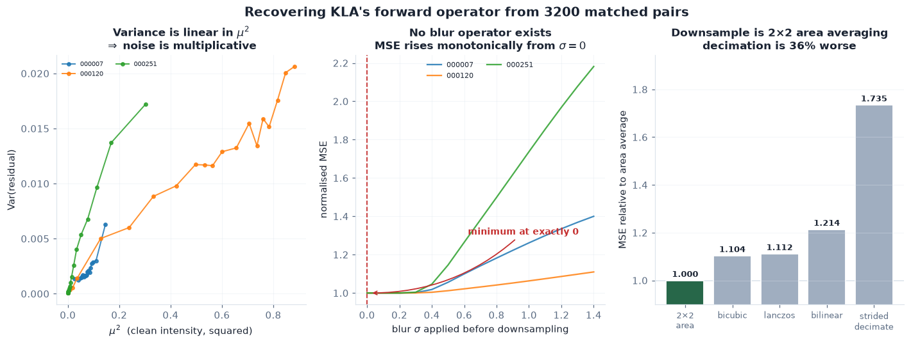
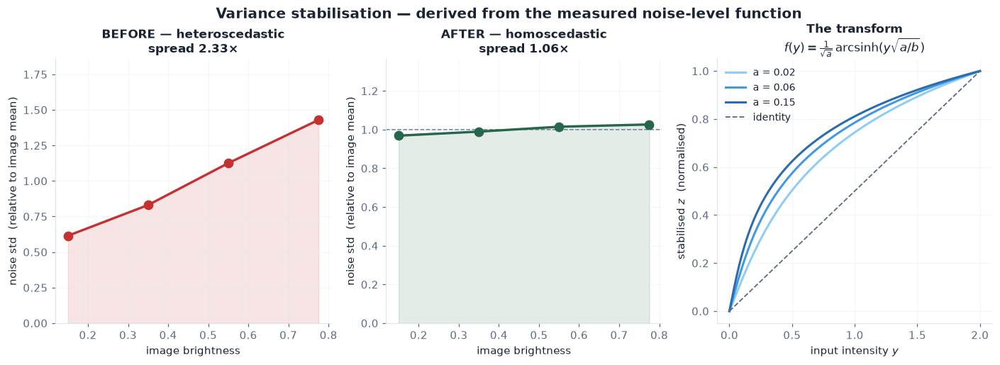
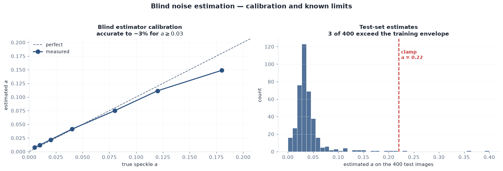
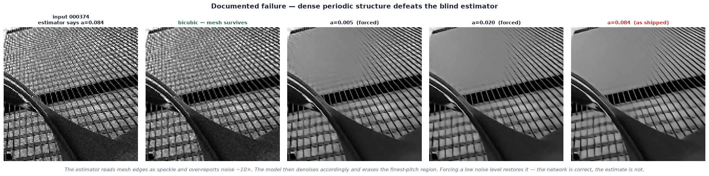

<div align="center">

# 🔬 Degradation-Aware Image Restoration

**Recovering clean, full-resolution images from speckled, noisy, half-resolution inspection scans**

[](https://pytorch.org)
[](https://python.org)
[](LICENSE)
[]()
[]()

**SEMICON India Hackathon 2026 · Problem Statement 1 · KLA**

<table>
<tr>
<td align="center"><b>PSNR</b><br><code>28.531 dB</code><br><sub>ceiling 38.67</sub></td>
<td align="center"><b>SSIM</b><br><code>0.7776</code><br><sub>bicubic 0.5721</sub></td>
<td align="center"><b>LPIPS</b><br><code>0.2731</code><br><sub>bicubic 0.4153</sub></td>
<td align="center"><b>Position</b><br><code>32.8%</code><br><sub>floor → ceiling</sub></td>
</tr>
</table>


<sub><i>Held-out test images. Left: degraded input. Middle: bicubic — what you get for free. Right: our restoration.</i></sub>

</div>

---

## ⚡ Quick start

```bash
git clone https://github.com/yashwanth-maram/Semicon_2026.git
cd Semicon_2026
pip install -r requirements.txt
python evaluate.py --input-dir /path/to/test --output-dir ./restored
```

> [!NOTE]
> That is the entire procedure. `weights/model.pt` is committed to the repo — **no download step, no Git LFS, no configuration.**

**Accepts** a single `.npy`, a flat directory, or nested subdirectories (searched recursively).
**Produces** one restored `.npy` per input, same filename, subdirectory structure mirrored.
**Runs on** GPU if available, CPU otherwise. Handles `128→256` and `256→512`, including mixed sizes in one directory.

<details>
<summary><b>Command-line options</b></summary>

<br>

| Flag | Default | Effect |
|:--|:--|:--|
| `--input-dir` | *required* | `.npy` file or directory (recursive) |
| `--output-dir` | *required* | where restored images are written |
| `--batch-size` | `16` | lower it if memory is tight |
| `--no-ensemble` | off | 8× faster, ~0.2 dB lower |
| `--device` | auto | force `cuda` or `cpu` |
| `--weights` | `weights/model.pt` | alternative checkpoint |

</details>

---

## 📊 Results

Measured on a held-out, **content-clustered** validation split of 309 images, using KLA's *actual* `NoisyLR` files with **blind** parameter estimation. No ground truth or prior knowledge used at inference.

| | PSNR ↑ | SSIM ↑ | LPIPS ↓ | position |
|:--|--:|--:|--:|--:|
| Bicubic ×2 | 23.586 dB | 0.5721 | 0.4153 | 0% |
| **This model** | **28.531 dB** | **0.7776** | **0.2731** | **32.8%** |
| *GT noise-floor ceiling* | *38.674 dB* | — | — | *100%* |

> [!IMPORTANT]
> **The ceiling is real and it is measured.** The supplied ground truth is not clean
> — its own noise floor (wavelet-MAD over all 3,200 GT images, mean of per-image
> ceilings) caps *any* method at ≈38.7 dB. We report absolute position rather than
> gain over bicubic, because that is the scale a reviewer comparing teams is
> effectively using. **10.14 dB of headroom remains.**
>
> The estimator over-reads texture as noise, which *understates* the ceiling and
> therefore *flatters* this position. True position is at most 32.8%.

### Gain by degradation severity

```
very mild   ▏+1.04 dB
mild        ▏+0.63 dB
moderate    ▎+0.84 dB
severe      ████████████████ +8.16 dB
```

> [!TIP]
> **That asymmetry is the whole design.** Heavy degradation is normalised into the regime the network already handles well — see [the transform](#2-a-variance-stabilising-transform-derived-from-that-operator).

### Generalisation — four corpora, none used in training

| Corpus | n | Mild | Severe |
|:--|--:|--:|--:|
| *KLA val (reference)* | 309 | +3.42 | **+8.16** |
| BSD100 | 100 | +2.68 | **+6.90** |
| Set14 | 14 | +2.66 | **+6.84** |
| DIV2K | 100 | +2.28 | **+6.04** |
| Urban100 | 100 | +1.83 | **+5.28** |

**314 unseen images, 5.3–6.9 dB on severe degradation.** The model inverts the *operator*, not the dataset.



### Performance

<table>
<tr><td>Parameters</td><td align="right"><code>2.76 M</code></td><td>Weights on disk</td><td align="right"><code>11.1 MB</code></td></tr>
<tr><td>Single pass</td><td align="right"><code>3.68 ms/img</code></td><td>8× self-ensemble</td><td align="right"><code>29.4 ms/img</code></td></tr>
<tr><td>Full 400-image test set</td><td align="right"><code>11.8 s</code></td><td>CPU fallback</td><td align="right"><code>839 ms/img</code></td></tr>
</table>

<sub>Measured on A100-SXM4-80GB. H100 is typically 1.5–2× faster for this workload.</sub>

---

## 🔄 How an image flows through the pipeline



<details>
<summary><b>The same flow as annotated tensor shapes</b></summary>

<br>

```python
y                         # (B, 1, 128, 128)   unclipped, up to 2.16

a, b = estimate_nlf(y)    # (B,), (B,)         per-image, unsupervised
z    = vst(y, a, b)       # (B, 1, 128, 128)   noise now ~unit variance
c    = cond(a, b)         # (B, 64)            degradation embedding

x  = inp((z - μ_z) / σ_z) # (B,  64, 128, 128) instance-normalised
x  = e1(x, c)             # (B,  64, 128, 128) ─┐ skip s1
x  = d1(x)                # (B, 128,  64,  64)  │
x  = e2(x, c)             # (B, 128,  64,  64) ─┼─┐ skip s2
x  = d2(x)                # (B, 256,  32,  32)  │ │
x  = mid(x, c)            # (B, 256,  32,  32)  │ │ bottleneck
x  = u2(x) + s2           # (B, 128,  64,  64) ←┼─┘
x  = f2(x, c)             # (B, 128,  64,  64)  │
x  = u1(x) + s1           # (B,  64, 128, 128) ←┘
x  = f1(x, c)             # (B,  64, 128, 128)

μ̂  = ivst(z + dg·h(x)·σ_z, a, b)   # (B, 1, 128, 128)  denoised, low-res
h  = hr_up(x)                       # (B, 64, 256, 256) PixelShuffle ×2
h  = hr_ref(h, c)                   # (B, 64, 256, 256) refine at full res

out = bicubic(μ̂)↑2 + hr_out(h)      # (B, 1, 256, 256)  final
```

Both heads are **zero-initialised**, so at step zero the model output equals the
bicubic baseline exactly — every gradient update is an improvement on a sensible
starting point rather than a climb out of noise. Verified: initialisation scores
within 0.19 dB of bicubic.

</details>

> [!TIP]
> **Steps A and B are the whole trick.** Because `(a, b)` come from the image itself, an image degraded far beyond anything in training arrives at the network already *standardised*. The network never sees a regime it wasn't trained for — the transform erased the difference first.

---

## 🧠 Method

### 1 · The degradation operator was measured, not assumed

Recovered from 3200 matched pairs:

```python
mu = AreaAvg_2x2(x)                       # 2×2 mean — NOT decimation
y  = mu * s + n                           # both applied at LOW resolution
#    s ~ Gamma(L, 1/L)                    multiplicative speckle, mean 1
#    n ~ Normal(0, sigma²)                additive Gaussian
```

> [!IMPORTANT]
> **Three findings that contradict the obvious reading of the brief:**
>
> **There is no blur operator.** MSE against blur σ is minimised at exactly `0.0` and rises monotonically — every pair, both orderings.
>
> **The downsample is 2×2 area averaging.** Strided decimation is 36% worse, bicubic 5% worse.
>
> **Round-trip validated.** Synthesising with the fitted parameters reproduces KLA's noise-level function to **2.3% median error** across 300 pairs.


<sub><i>Left: residual variance is linear in μ² across nine independent images — the signature of multiplicative noise, established from data alone. Centre: MSE against blur σ, minimised at exactly zero. Right: the downsample operator comparison.</i></sub>

### 2 · A variance-stabilising transform, derived from that operator

The measured operator implies `Var(y|μ) = a·μ² + b` — **heteroscedastic**, noise grows with signal. A plain L2 objective assumes constant variance and mis-weights the image everywhere, over-trusting bright pixels where the data is *least* reliable.

At measured values a bright pixel carries **39× the variance** of a dark one.

That variance form admits a closed-form stabilising transform:

$$f(y) = \frac{1}{\sqrt{a}} \cdot \operatorname{arcsinh}\left(y\sqrt{a/b}\right)$$

<details>
<summary><b>Why this specific function — the derivation</b></summary>

<br>

By the delta method, for a smooth `f`:

```
Var[f(y)] ≈ [f′(μ)]² · Var[y]
```

Setting that to a constant and substituting the measured noise-level function:

```
[f′(μ)]² · (a·μ² + b) = 1     ⟹     f′(μ) = 1 / √(a·μ² + b)
```

Integrating (substitute `μ = √(b/a)·sinh t`) gives the transform above.

**It is not a design choice.** It is the unique function that flattens the variance we measured.

**Limits, both of which occur in the data:**
- `b → 0` (pure speckle) → reduces to the **log transform** of classical SAR despeckling
- `a → 0` (pure Gaussian) → reduces to scaling by σ

Both are handled by an exact branch rather than a clamp.

</details>

**Measured effect:** noise standard deviation across brightness bands goes from a **2.24× spread to 1.06×** — flat, at unit variance, as designed.


<sub><i>Left: raw noise grows with brightness. Middle: after the transform it is flat. Right: the transform itself, at three severities.</i></sub>

> [!NOTE]
> `(a, b)` are estimated **per image at inference**, unsupervised — 0.978 correlation with true total variance, 8.4% median error. The transform therefore adapts to *any* severity, including regimes absent from training. **This is what carries the model to unseen corpora.**

### 3 · A gated identity path

Early versions applied denoising unconditionally and **damaged clean input by 4.3 dB** — stripping detail that was never noise.

| | before gate | after gate |
|:--|--:|--:|
| Clean-input PSNR | 27.09 dB | **29.80 dB** |
| Denoiser damage | 29.45 dB | **36.34 dB** |
| Learned gate on clean input | — | **0.680** |

A learned scalar gate, conditioned on the measured noise level, lets the network decide *how much* to denoise. It converged to 0.68 rather than 1.0 — it learned to modulate.

### 4 · Trained on real and synthetic pairs together

> [!WARNING]
> Training purely on self-synthesised degradation produced **excellent synthetic scores and near-zero real-world benefit**: +0.26 dB, with SSIM *below* plain bicubic. The model had learned to invert *our* operator rather than KLA's — and the synthetic metrics hid it completely.

Mixing 50% of KLA's actual pairs into training took that to **+4.03 dB** — and synthetic performance improved too. The two distributions share representation rather than competing.

---

## ⚠️ Things that are easy to get wrong

<details open>
<summary><b>Do not clip the input to [0,1]</b></summary>

<br>

Observed input range is `[−0.279, 2.158]`; up to **12% of pixels legitimately exceed 1.0** — speckle pushing values beyond the original signal, exactly as the problem statement describes. A `clamp(0,1)` in preprocessing destroys real signal.

</details>

<details>
<summary><b>Do not renormalise the output by min–max — costs 4.07 dB</b></summary>

<br>

Ground truth has exactly one pixel at 0 and one at 1 because KLA normalised a *clean* image. Applying the same to a prediction rescales by the **noise outliers** rather than the signal.

</details>

<details>
<summary><b>126 ground-truth images (3.9%) are structureless noise</b></summary>

<br>

They appear in contiguous index blocks — `2537–2539`, `2637–2638`, `2981–2983`, `625–626` — suggesting one bad batch at source. Excluding them changes measured gain by only `+0.086 dB`, so we report on the full set for comparability. They are unlearnable.

</details>

<details>
<summary><b>Some ground truth is itself grainy</b></summary>

<br>

Up to `σ ≈ 0.038` within GT images. On those, *perfect* denoising **reduces** PSNR, because the target retains the grain.

</details>

---

## 🎯 Where the model fails

We characterised our own weakness rather than waiting for a reviewer to find it.


<sub><i>Left: blind estimator accuracy against known parameters — reliable to ~3% for a ≥ 0.03. Right: estimates across the 400 test images, with the training-envelope clamp marked.</i></sub>

On **dense periodic structure** the high-pass filter reads repeating edges as speckle and over-reports noise. The model then denoises accordingly and erases the finest-pitch detail:


<sub><i>Image 000374. Bicubic preserves the mesh; we erase it. Forcing a low noise level restores it — the network is correct, the estimate is not.</i></sub>

> [!NOTE]
> Affects 3 of 400 test images severely and a handful more mildly. We implemented a flat-patch estimator designed to fix it; it scored **−0.244 dB** on the held-out split and was rejected. See [`docs/ablations.md` § 7c](docs/ablations.md).

---

## 🧪 Ablations — eight rungs, seven rejections

Every component was tested as a controlled change, with decision rules fixed **before** any result was seen.

| Rejected | Cost | Why it failed |
|:--|--:|:--|
| Min–max output renorm | `−4.07 dB` | Rescales by noise outliers, not signal |
| Data-consistency projection | `−0.70 dB` | Stamps the denoiser's own error in as truth |
| Band-weighted FFT loss | `HF halved` | Relative denominator *rewarded* smoothing |
| Clean-GT retrain | `+0.086 dB` | Not worth the compute |
| Two-model ensemble | `+0.029 dB` | Below the noise floor, 2× the cost |
| Flat-patch noise estimator | `−0.244 dB` | Dense texture defeats spatial separation |
| HF *retention* metric | *superseded* | Counted residual noise as detail |

> [!TIP]
> The last one is a **methodological error we caught in ourselves** — it nearly caused the better model to be discarded. Full detail, with the measurement that killed each component, in **[`docs/ablations.md`](docs/ablations.md)**.

---

## 📁 Repository

```
├── evaluate.py              ⭐ inference — self-contained, runs as-is
├── train.py                 reproduces the model from scratch
├── compare.py               visual comparison tool
├── test_estimator.py        the rejected estimator experiment
├── absolute_analysis.py     ceiling + matched-baseline analysis
├── requirements.txt         minimal deps for evaluate.py
├── requirements-train.txt   full training environment
├── weights/model.pt         final weights (11 MB, committed)
├── outputs/                 restored test set (400 images)
├── src/
│   ├── vst.py               noise estimation + variance-stabilising transform
│   ├── model.py             network
│   ├── degrade.py           the verified forward operator
│   └── metrics.py           PSNR, SSIM, high-frequency error
├── make_figures.py          regenerates every figure below
└── docs/
    ├── ablations.md         8 rungs, 7 documented rejections
    └── figures/
        ├── 01_forward_model.png
        ├── 02_variance_stabilisation.png
        ├── 03_before_after.png
        ├── 04_generalisation.png
        ├── 05_failure_case.png
        └── 06_estimator_calibration.png
```

> [!NOTE]
> `evaluate.py` **deliberately duplicates** the model definition rather than importing from `src/`, so a broken `PYTHONPATH` or a missing package cannot stop the benchmark from running. `src/` holds the same code in modular, documented form.

---

## 🔧 Developer tools

Not required for inference — included as evidence of the analysis.

```bash
# visual comparison: input | bicubic | restored, with estimated noise params
python compare.py --input <file or dir> --indices 17,195,374
python compare.py --input <file> --zoom 10,10,50       # magnify a region

# the rejected estimator experiment (needs pytorch-msssim, scikit-learn)
python test_estimator.py --gt-dir <train/GT> --lr-dir <train/NoisyLR>

# regenerate every figure in docs/figures/ (needs matplotlib, scipy)
python make_figures.py --gt-dir <train/GT> --lr-dir <train/NoisyLR> \
                       --test-dir <Test_NoisyLR> --out docs/figures
```

`compare.py` prints the estimated `(a, σ)` per image and flags when the clamp fires — useful for telling apart *model* failure from *estimator* failure.

---

## 🔁 Reproducing training

```bash
pip install -r requirements-train.txt

python train.py --data-dir /path/to/train --out weights/model.pt \
                --hp-loss --epochs 200 --lr 6e-4
```

`--data-dir` must contain `GT/` (256×256 `.npy`) and `NoisyLR/` (128×128 `.npy`) with matching filenames.

**Reference run:** A100-SXM4-80GB · 200 epochs · 36,000 optimiser steps · **2h 30m**

> [!CAUTION]
> **fp32 is required.** Mixed precision produces NaN: `sinh` in the inverse VST overflows fp16 above an argument of ~11, and `ms_ssim` underflows in its five-scale product. Measured under autocast: **792 of 2891 batches** produced non-finite loss and EMA weights froze entirely.

<details>
<summary><b>Training hygiene</b></summary>

<br>

- **Content-clustered validation split** (KMeans on 16×16 thumbnails) so near-duplicates cannot straddle train and val
- **Checkpoint selection on real-pair PSNR**, never on training loss
- **EMA weights** (decay 0.998) for all evaluation and the final export
- **Finiteness guards** skip any batch producing non-finite loss or gradient norm
- **Fixed seeds** for torch, numpy and the clustering
- **Gradient clipping** at 0.5

</details>

---

## 📖 Documentation

| Document | Contents |
|:--|:--|
| [`docs/ablations.md`](docs/ablations.md) | Every rung, every rejection, with the measurement behind it |
| [`src/vst.py`](src/vst.py) | The transform, its derivation and its known failure mode |
| [`src/degrade.py`](src/degrade.py) | The verified forward operator and how it was confirmed |
| [`docs/absolute_comparison.md`](docs/absolute_comparison.md) | Absolute position against the GT noise-floor ceiling |

---

<div align="center">
<sub>MIT License · Built for SEMICON India Hackathon 2026</sub>
</div>